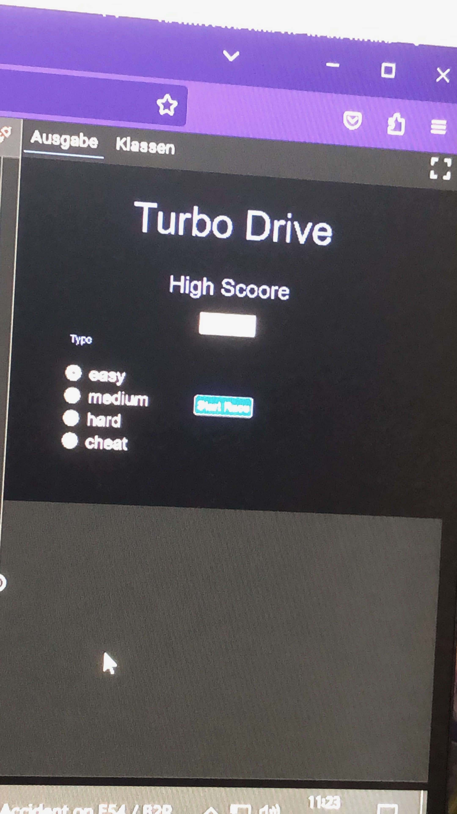

# Projekt "Arkade Auto Rennen"

### Team

- Max
- Korbinain 
- Fabian

### Beschreibung
Geplant ist ein klassissches Arkade Spiel mit mehreren autospuren.
Das spiel wird als einzelspieler laufen, mit einem Highscore-Ergebnis. Umgesetzts soll es mit Java in der online-ide laufen.

### Backlog Grobplanung

| Nummer      | Titel                 | Status     |
| ----------- | --------------------- | -----------|
| 1           | "Der Spieler kann auf dem Startbildschirm seinen Namen eingeben"| zu tun     |
| 2           | "Der Spieler kann auf dem Startbildschirm die Schwirigkeit des Spiels einstellen"| zu tun    |
| 3           | "Der Spieler kann auf dem Startbildschirm seinen Highscore sehen"| zu tun|
| 4           |"Der Spieler kann auf dem Startbildschirm das Spiel starten" | zu tun     |
| 5           |"Der Spieler kann im Spielbildschirm das Fahrzeug in alle Richtungen steuern"| zu tun     |
| 6           |"Im Spiel wird der Effekt von Bewegung erzeugt"| zu tun     |
| 7           |"Im Spiel werden Hindernisse erzeugt" | zu tun     |
| 8           |"Bei einer Kollision wird zum "Gameover"-Screen gewechselt" | zu tun               |
| 8           |"Nach der sekunden des "Gameover"-Screens wird automatisch in der "Score"-Screen gewechselt" | zu tun     |
| 9           |"Der Spieler kann im dem "Score"-Bildschirm auf de Startbildschirm wechseln " | zu tun     |
| 10           |"Der Spieler kann vom Startbildschirm in den "Score"- Bildschirm wechseln" | zu tun     |
| 11          |"Der Spieler kann vom Spielbildschirm in der Startbildschirm wechseln" | zu tun     |
| 12          |"Der Spieler kann im Statbildschirm der FArbe der Autos wechseln" | zu tun     |

### Bildschirm Entwürfe
####Startbildschirm:

###Spielbilschirm:

###"Score"-bilschirm:

###Spielbilschirm:

###"Gameover"-bilschirm:

