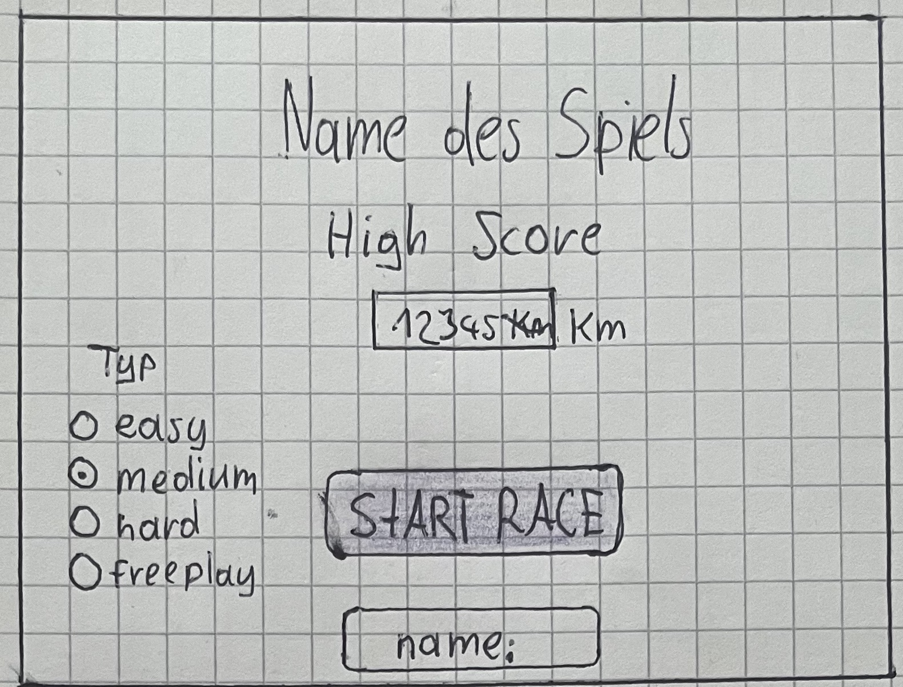
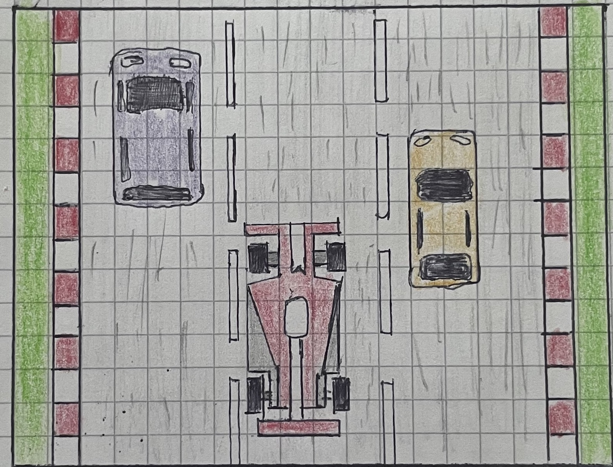
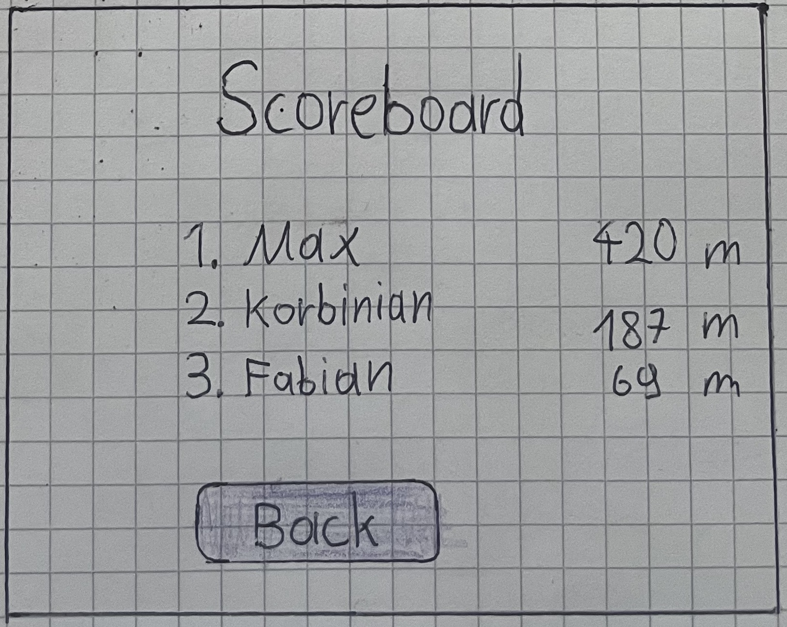

# Projekt "Arkade Auto Rennen"

### Team

- Max 
- Korbinain 
- Fabian

### Source Code Verwaltung

Der Quellcode wird mit der Online IDE (https://www.online-ide.de) verwaltet unter dem Projektnamen "Projekt_Arkade_Game_Auto_Rennen_Mai_2023"

### Beschreibung
Geplant ist ein klassissches Arkade Spiel mit mehreren Autospuren.
Das Spiel wird als einzelspieler laufen, mit einem Highscore-Ergebnis. 
Umgesetzts soll es mit Java in der Online-IDE laufen.

### Grober Zeitplan

| Sprint      | Thema                                    | Start      | Ende        |
| ----------- | ---------------------------------------- | -----------|-------------|
| 1           | Kernfuntionalität                        | 27.05.2023 | 03.06.2023  |
| 2           | GUI Verbesserungen                       | 03.05.2023 | 12.06.2023  |
| 3           | Ergänzungen                              | 12.06.2023 | 26.06.2023  |
| 4           | Vorbereitung Präsentation & Refactoring  | 26.06.2023 | 31.06.2023  |

### Backlog 

Grobplanung der Sprints mit User Storries, Zuständigkeiten und Bearbeitungsstatus

| Nummer  | Sprint  | Status     | Bdearbeiter | Titel                
| ------- | --------|------------|-------------|----------------------------------------------------------------------------------------------------|
| 4       | 1       | In Arbeit  | Max         | "Der Spieler kann auf dem Startbildschirm das Spiel starten"                                        
| 5       | 1       | Erledigt   | Korbinian   | "Der Spieler kann im Spielbildschirm mit den Pfeildtasten die Fahrspur für sein Fahrzeug ändern"   
| 6       | 1       | Neu        | Max         | "Der Spieler sieht den Effekt von entkommenden Fahrzeugen"                                                                         
| 8       | 1       | Neu        | Korbinan    | "Dem Spieler wird bei einer Kollision der "Gameover"-Screen gewechselt und sein Ergebnis gezeigt" 
| 7       | 1       | Neu        | -           | "Dem Spieler werden unterschieliche Design für Fahrzeuge gezeigt"
| 9       | -       | Neu        | -           | "Der Sieler wird nach drei Sekunden des "Gameover"-Screens wird automatisch in der "Score"-Screen weiter geleitet"
| 6       | -       | Neu        | -           | "Der Spieler sieht den Effekt von Bewegung der Fahrbahn und Leitplanken"     
| 13      | -       | Neu        | -           | "Der Spieler kann im Statbildschirm der Farbe der Autos wechseln"   
| 2       | -       | Neu        | -           | "Der Spieler kann auf dem Startbildschirm die Schwirigkeit des Spiels einstellen"   
| 1       | -       | Neu        | -           | "Der Spieler kann auf dem Startbildschirm seinen Namen eingeben"     
| 3       | -       | Neu        | -           | "Der Spieler kann auf dem Startbildschirm seinen Highscore sehen"
| 11      | -       | Neu        | -           | "Der Spieler kann vom Startbildschirm in den "Score"-Bildschirm wechseln"    
| 10      | -       | Neu        | -           | "Der Spieler kann im dem "Score"-Bildschirm auf den Startbildschirm wechseln (ESC)"     
| 12      | -       | Neu        | -           | "Der Spieler kann vom Spielbildschirm in der Startbildschirm wechseln (ESC)"    

### Bildschirm Entwürf

#### 1) Start

#### 2) Spiel

#### 3) Gameover

TODO

#### 4) Score

